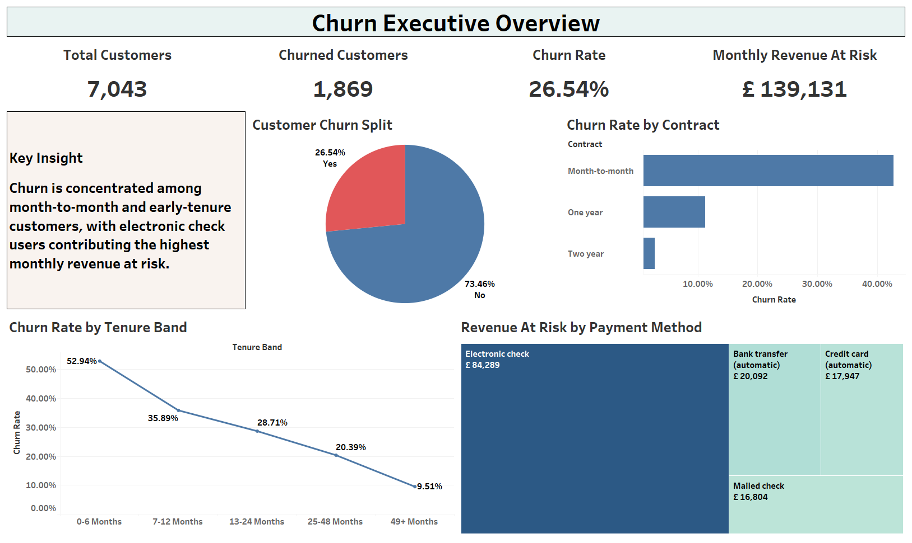
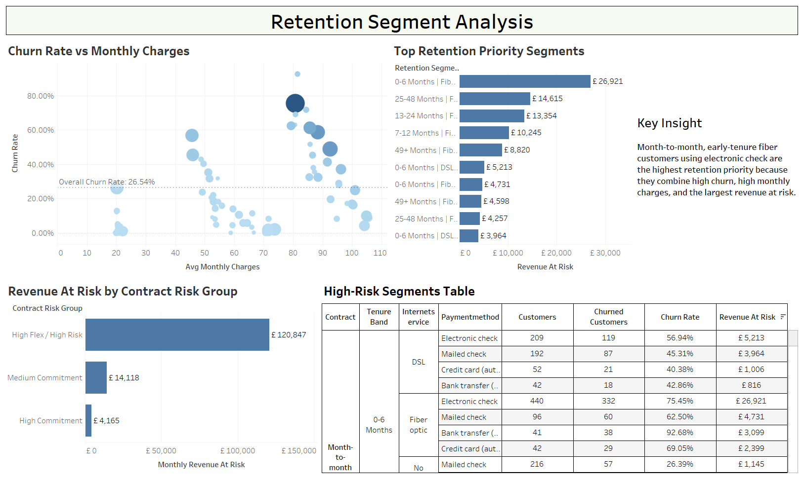
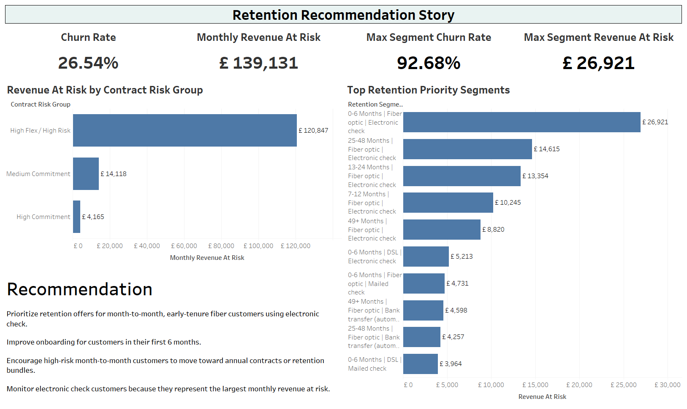

# Customer Churn & Retention Analytics

This project analyzes telecom customer churn using the public Telco Customer Churn dataset. The goal is to understand which customer groups are more likely to churn, where monthly revenue leakage is concentrated, and what retention actions should be prioritized.

## Data Source

Dataset: Telco Customer Churn  
Source: Kaggle  
URL: https://www.kaggle.com/datasets/blastchar/telco-customer-churn

Kaggle datasets have dataset-specific licenses. Check the Kaggle dataset page before publishing the raw data in a public repository.

## Business Questions

- What is the overall churn rate?
- Which contract types, payment methods, and tenure bands show higher churn?
- Which customer groups create the highest monthly revenue leakage?
- How does churn behavior change across tenure cohorts?
- Which segments should be targeted for retention campaigns?

## Project Workflow

```text
Raw Kaggle CSV
        -> Python cleaning and feature engineering
Processed churn dataset
        -> SQL KPI and segmentation logic
Tableau dashboard
        -> Retention recommendations
```

## Prepared Data Summary

- Clean customer rows: 7,043
- Churned customers: 1,869
- Overall churn rate: 26.54%
- Monthly recurring revenue: 456,116.60
- Monthly revenue at risk: 139,130.85

## Tableau Dashboard Pages

### 1. Churn Executive Overview

This dashboard summarizes overall churn performance, churn split, churn rate by contract, churn rate by tenure band, and monthly revenue at risk by payment method.



Main views:

- Total Customers
- Churned Customers
- Churn Rate
- Monthly Revenue At Risk
- Customer Churn Split
- Churn Rate by Contract
- Churn Rate by Tenure Band
- Revenue At Risk by Payment Method

### 2. Retention Segment Analysis

This dashboard identifies which customer segments should be prioritized for retention based on churn rate, monthly charges, segment size, and revenue at risk.



Main views:

- Churn Rate vs Monthly Charges
- Top Retention Priority Segments
- Revenue At Risk by Contract Risk Group
- High-Risk Segments Table

### 3. Retention Recommendation Story

This dashboard presents final retention KPIs and management recommendations.



Main views:

- Churn Rate
- Monthly Revenue At Risk
- Max Segment Churn Rate
- Max Segment Revenue At Risk
- Revenue At Risk by Contract Risk Group
- Top Retention Priority Segments
- Recommendation text

## Business Insights

- Overall churn rate is 26.54%, meaning more than one quarter of customers in the dataset churned.
- Month-to-month customers have the highest churn risk compared with one-year and two-year contracts.
- Customers in their first 6 months show the highest churn rate, making early lifecycle intervention important.
- Electronic check users represent the largest monthly revenue at risk.
- The top retention-priority segment is early-tenure, month-to-month fiber customers using electronic check.

## Business Recommendations

- Prioritize retention offers for month-to-month, early-tenure fiber customers using electronic check.
- Improve onboarding for customers in their first 6 months.
- Encourage high-risk month-to-month customers to move toward annual contracts or retention bundles.
- Monitor electronic check customers because they represent the largest monthly revenue at risk.

## Project Outputs

```text
data/raw/WA_Fn-UseC_-Telco-Customer-Churn.csv
data/processed/telco_churn_clean.csv
data/processed/churn_segment_summary.csv
sql/churn_kpi_queries.sql
tableau/calculated_fields.md
tableau/dashboard_blueprint.md
analysis/executive_summary.md
images/churn_executive_overview.png
images/retention_segment_analysis.png
images/retention_recommendation_story.png
Dashboard.twb
```

## Portfolio Positioning

This project should be presented as a customer retention analytics case study supported by Python, SQL, and Tableau. It demonstrates data cleaning, feature engineering, churn KPI design, segment-level analysis, revenue-at-risk analysis, and retention recommendation writing.
